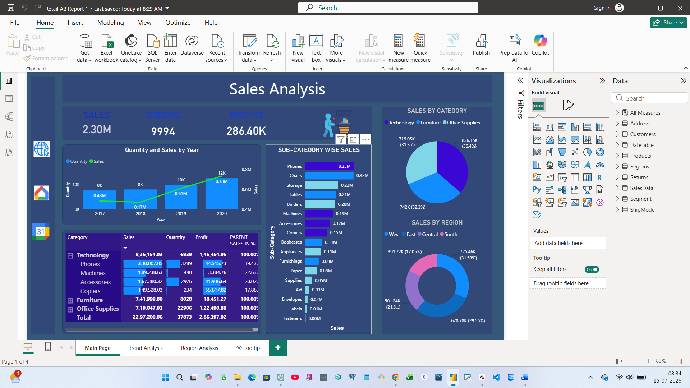
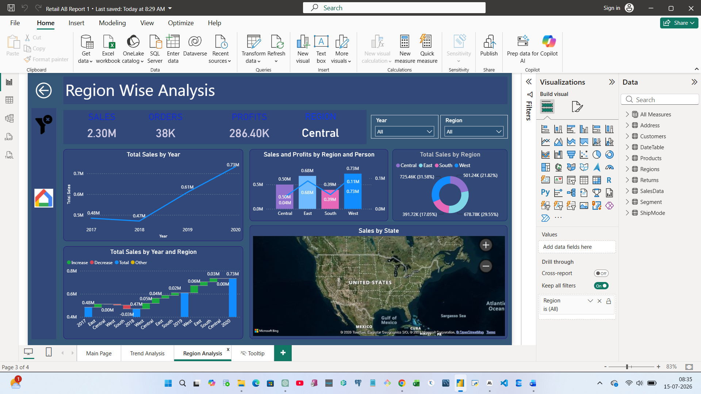
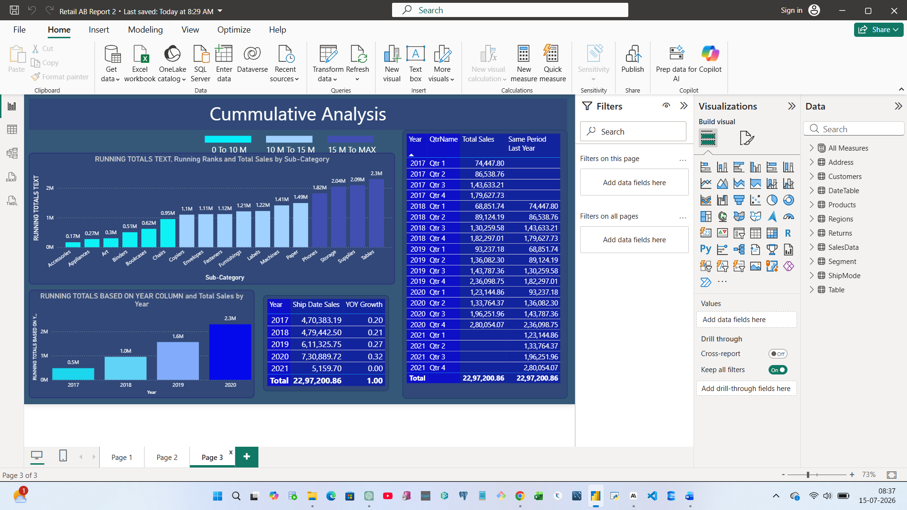
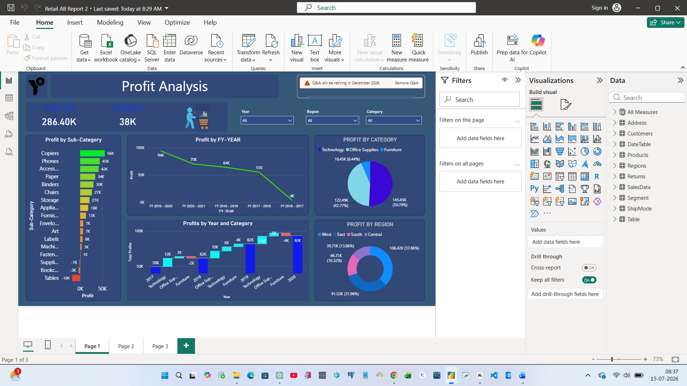

# PowerBI-RetailAB: Retail Sales & Profitability Analytics

**An end-to-end Power BI portfolio project** covering the full BI development lifecycle — from Power Query data preparation and star-schema data modeling, through advanced DAX measures, to a multi-page, interactive dashboard suite and Power BI Service deployment.

## 📌 Project Overview

This project simulates a real-world retail & e-commerce analytics scenario. Using a 9-table retail order-management dataset (sales, returns, customers, products, regions, shipping), it demonstrates the complete lifecycle of a production-grade BI solution — not just charts, but a properly modeled, well-governed, and business-ready analytics product.

**Business problem solved:** Retail leadership needs a single source of truth to track sales, profitability, regional performance, and shipping efficiency — with the ability to drill from company-wide trends down to individual sub-categories, states, and order dates.

## 🛠️ Tools & Technologies

- Power BI Desktop & Power BI Service
- DAX (Data Analysis Expressions)
- Power Query (M)
- Star-schema data modeling

## 🗂️ Source Data

Retail order-management extract covering multi-year sales, returns, shipping, and customer information across **9 tables**:

| Table | Type |
|---|---|
| SalesData | Fact |
| Returns | Fact |
| Products | Dimension |
| Customers | Dimension |
| Address | Dimension |
| Regions | Dimension |
| Segment | Dimension |
| ShipMode | Dimension |
| DateTable | Dimension (Calendar + Fiscal Year) |

## 🏗️ Data Modeling

- Clean **star schema**: SalesData (fact) related to Products, Regions, ShipMode, Segment, Returns, Customers, Address, and DateTable — all Many-to-One, no circular relationships.
- **Three drill-down hierarchies:**
  - **Year Hierarchy:** Year → Quarter Name → Month Name → Week Number → Weekday Name
  - **Product Hierarchy:** Category → Sub-Category → Product Name
  - **Country Hierarchy:** Country → State → City
- Custom fiscal-year sorting (FY-Year and FY-Quarter sorted numerically, not alphabetically).
- A parameterized `StartDate` load filter for incremental-style data loading in Power Query.

## 📊 Reports & Dashboards

### RetailAB Report 1
| Page | Highlights |
|---|---|
| **Sales Analysis** | KPI cards (Sales, Orders, Profits), Quantity & Sales combo chart by year, Category/Sub-Category matrix, Category pie chart, Regional donut chart |
| **Region Wise Analysis** | Regional KPIs, Sales trend line, Sales & Profit combo chart, Waterfall chart, Filled map of Sales by State |
| **Calendar Date Wise Sales** | Monthly/quarterly/fiscal-year sales trends, Order Date vs. Ship Date sales comparison |

Includes a **custom tooltip page** showing category-level Sales, Profit, and Quantity KPIs with a trend line on hover.

### RetailAB Report 2 (Live Connection to RetailAB dataset)
| Page | Highlights |
|---|---|
| **Profit Analysis** | Profit/Order KPIs, Sub-Category profit bar chart, FY-Year trend, Profit waterfall by Year & Category, natural-language Q&A visual |
| **Sub-Category, Shipping & Segment Analysis** | Sales vs. Profit scatter chart (bubble = quantity), ShipMode 100% stacked bar, Segment/Region profit breakdowns |
| **Cumulative Analysis** | Running totals by Sub-Category and Year with color-coded value bands, Same-Period-Last-Year and YoY Growth % tables, custom legend |

## 📈 Screenshots

*Main landing dashboard — KPI cards, category/region charts, category drill-down matrix.*

*Regional KPIs, waterfall trend, and a filled map of Sales by State.*

*Month, quarter, and fiscal-year sales trends with an Order Date vs. Ship Date comparison.*

*Profitability KPIs, Sub-Category bar chart, FY-Year trend, and a Q&A box.*

*Running-total charts by Sub-Category and Year, plus a Same-Period-Last-Year comparison table.*

## 🧮 DAX

Full list of measures used across both reports is documented in [`dax/measures.md`](dax/measures.md).

## 🎯 Key Skills Demonstrated

- Power Query ETL: parameter-based filtering, data type handling, calculated columns
- Star-schema data modeling with 9 tables and clean fact-to-dimension relationships
- Advanced DAX: `SUM`, `DIVIDE`, `CALCULATE`, `ALLEXCEPT`, `SAMEPERIODLASTYEAR`, `FILTER`-based running totals
- Multi-page report design with custom navigation, tooltips, and drill-through
- Live Connection (Report-on-Report) architecture and Power BI Service publishing

## 📬 Contact

**Nishkarsha** — Oracle PL/SQL & Power BI Developer | BFSI/CBS Domain
[LinkedIn] · [Naukri Profile]
